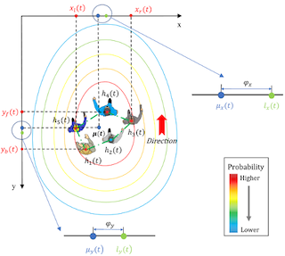

# DRL-GMM: drl-based robot crowd navigation with Gaussian mixture model

Implementation code of my bachelor's thesis. This project is inspired by paper ["DRL-VO: Learning to Navigate Through Crowded Dynamic Scenes Using Velocity Obstacles"](
https://doi.org/10.1109/TRO.2023.3257549
)([arXiv](https://arxiv.org/pdf/2301.06512.pdf)) in IEEE Transactions on Robotics (T-RO) 2023. I reproduced their work and modified the reward function with Gaussian mixture model.
* Reward:

* Simulation:
 
* Real world:
 

## Installation:
Please refer to this repository: https://github.com/TempleRAIL/drl_vo_nav.git.

## usage:
* person_detector: https://github.com/leggedrobotics/darknet_ros.git
* edge_leg_detector: https://github.com/marcobecerrap/edge_leg_detector.git
* person_track: https://github.com/Zhefan-Xu/onboard_detector.git

## Citation
```
@article{xie2023drl,
  author={Xie, Zhanteng and Dames, Philip},
  journal={IEEE Transactions on Robotics}, 
  title={{DRL-VO}: Learning to Navigate Through Crowded Dynamic Scenes Using Velocity Obstacles}, 
  year={2023},
  volume={39},
  number={4},
  pages={2700-2719},
  doi={10.1109/TRO.2023.3257549}}

@article{xie2023drl,
  title={{DRL-VO}: Learning to Navigate Through Crowded Dynamic Scenes Using Velocity Obstacles},
  author={Xie, Zhanteng and Dames, Philip},
  journal={arXiv preprint arXiv:2301.06512},
  year={2023}
}

@article{cai2022human,
  title={Human-aware path planning with improved virtual doppler method in highly dynamic environments},
  author={Cai, Kuanqi and Chen, Weinan and Wang, Chaoqun and Song, Shuang and Meng, Max Q-H},
  journal={IEEE Transactions on Automation Science and Engineering},
  volume={20},
  number={2},
  pages={1304--1321},
  year={2022},
  publisher={IEEE}
}

@article{xu2023onboard,
  title={Onboard dynamic-object detection and tracking for autonomous robot navigation with rgb-d camera},
  author={Xu, Zhefan and Zhan, Xiaoyang and Xiu, Yumeng and Suzuki, Christopher and Shimada, Kenji},
  journal={IEEE Robotics and Automation Letters},
  volume={9},
  number={1},
  pages={651--658},
  year={2023},
  publisher={IEEE}
}
```
